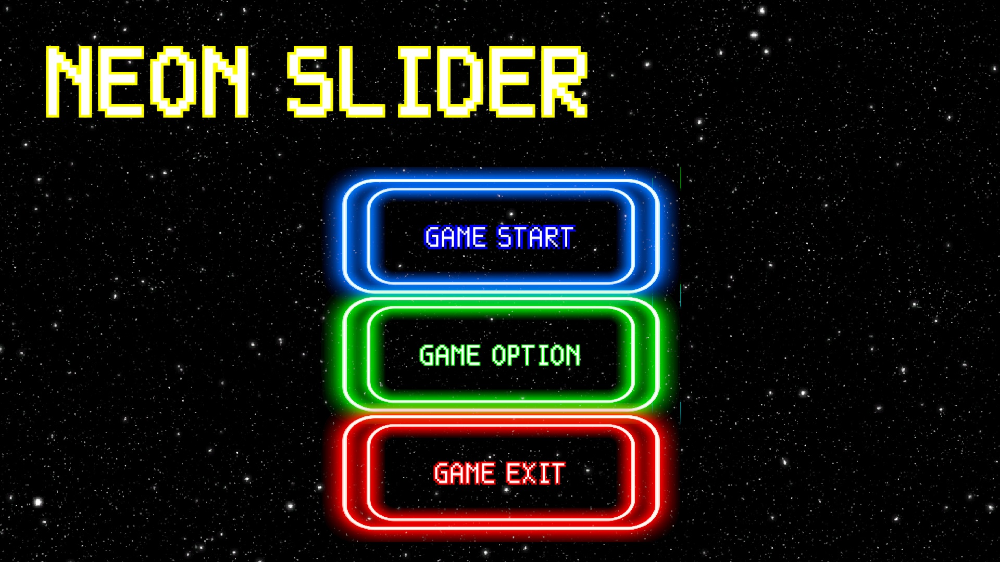
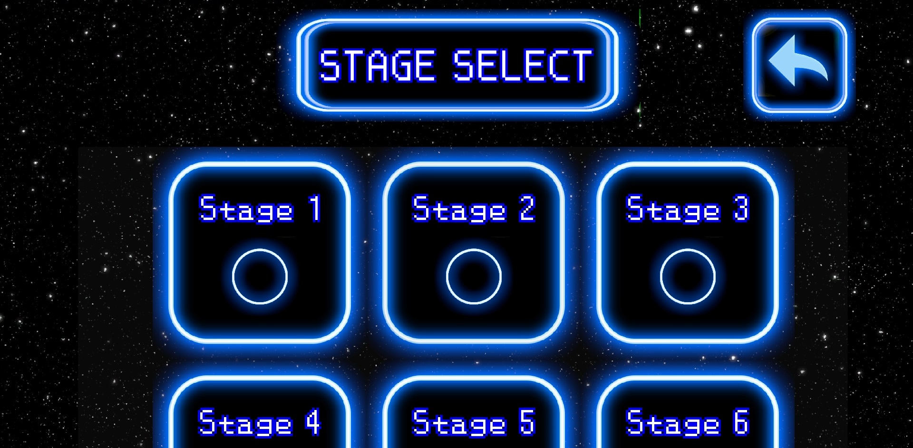
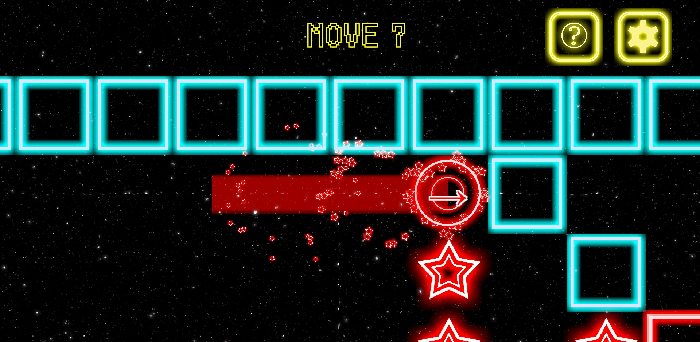

# NeonSlider
유니티 2021.3.16f1버전을 사용하여 제작한 2D 모바일 슬라이딩 퍼즐 게임

현재 스토어 링크는 관리 중단으로 내려간 상태 (과거 스토어 배포 이력만 존재)

스크린샷

타이틀

스테이지 선택

인게임 이미지

주요 기능

스와이프 이동: Touch 시작~종료 벡터를 정규화하여 상/하/좌/우 방향 판정 후 관성 이동

스테이지 데이터 JSON 관리: int[,] 기반 그리드 맵을 JSON으로 직렬화/역직렬화하여 런타임 생성

타일 타입: 빈공간/벽/도착/시작/별/부서지는벽(0부터 인덱싱)

스테이지 선택 화면 자동 구성: JSON에 등록된 갯수만큼 슬롯 자동 생성, ScrollView 컨테이너에 자식으로 배치

충돌/판정: Player는 Rigidbody + BoxCollider, 타일/오브젝트는 BoxCollider (isTrigger)

UI 입력 처리: IPointerDownHandler, IPointerUpHandler

기술 스택

Engine: Unity 2021.3.16f1 (LTS)

Language: C#

Target: Mobile (Android)

Libraries: Newtonsoft.Json (스테이지/설정 데이터 관리)

Patterns: Singleton(매니저), State(플레이어), 2D Grid/Tile 기반 로직

Input: Touch, IPointerDown/UpHandler
